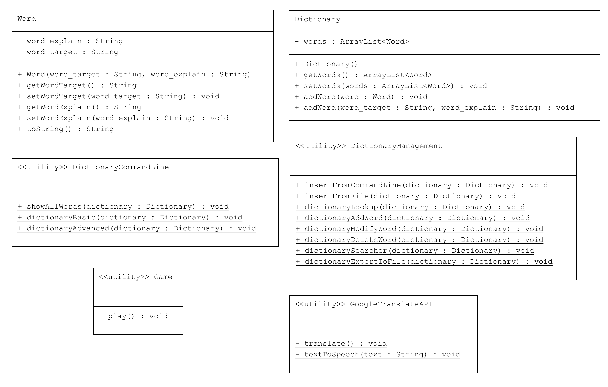

# Dictionary Project: OOP Major Assignment

## Introduction

This Dictionary Project is a part of the Object-Oriented Programming (OOP) Major Assignment.

## Instructions

1. Add "freetts-1.2.2-bin\freetts-1.2\lib" to the Project Modules Dependencies in your IDE.
2. Run "Main.main()" in "src" folder

## Members

 Le Xuan Bach - 22024506 (Leader)

 Dang Quoc Anh - 22028064

 Ngo Ngoc Anh - 22024524

## UML Diagram

